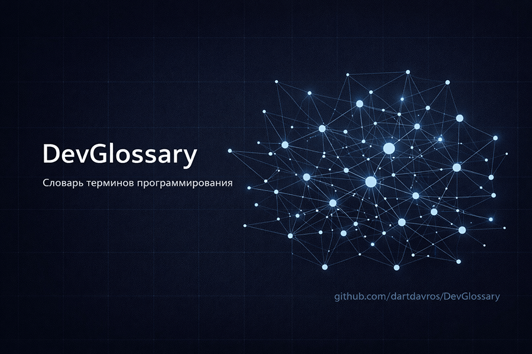

# 📜DevGlossary



**DevGlossary** — это инженерный словарь терминов программирования в формате Markdown.

Проект собирает в одном месте ключевые понятия из разработки, архитектуры, алгоритмов, конкурентности, баз данных, сетей, тестирования, DevOps и безопасности. Формат словаря рассчитан не на академические определения ради определений, а на практическое использование: быстро освежить термин в памяти, понять его назначение, увидеть пример и перейти к связанным понятиям.

## Для чего этот проект

У большинства разработчиков со временем накапливается набор терминов, которые «в целом знакомы», но не всегда одинаково хорошо уложены в голове. Особенно это заметно на стыке тем: например, где заканчивается композиция и начинается агрегация, чем concurrency отличается от parallelism, как practically воспринимать idempotency, optimistic locking или bounded context.

**DevGlossary** нужен для того, чтобы:

- держать базовые и продвинутые инженерные термины в одной системе;
- быстро находить краткое определение без лишней воды;
- читать развернутое объяснение, когда нужно восстановить контекст;
- связывать понятия между собой, а не хранить их как разрозненный список;
- постепенно расширять словарь без ломки структуры.

## Как устроен словарь

Каждая тема хранится в отдельном Markdown-файле внутри каталога `topics/`.

Внутри темы используется единый формат:

1. оглавление темы;
2. краткий список терминов и коротких определений;
3. подробные карточки терминов.

Каждая карточка термина содержит:

- **Кратко**
- **Полное определение**
- **Назначение**
- **Когда применять**
- **Ограничения / частые ошибки**
- **Примеры**
- **Связанные термины**

Такой формат позволяет использовать словарь сразу в двух режимах:

- как быстрый справочник;
- как более глубокую карту понятий по конкретной теме.

## Навигация

Главная точка входа:

- [INDEX.md](INDEX.md) — общее оглавление словаря и навигация по темам.

Шаблон для новых тем:

- [topics/_template.md](topics/_template.md)

## Веб-версия

Спасибо [ildu00](https://github.com/ildu00) за веб-версию проекта с поиском:  
[https://codopedia.ru/](https://codopedia.ru/)

Сайт тянет данные из репозитория **DevGlossary**, поэтому словарем можно пользоваться как в Markdown на GitHub, так и через удобный веб-интерфейс.

## Темы словаря

- [Architecture](topics/architecture.md) — архитектурные и проектировочные термины.
- [OOP](topics/oop.md) — объектно-ориентированные концепции.
- [Functional](topics/functional.md) — функциональные идеи и приемы.
- [Runtime and Memory](topics/runtime-memory.md) — память, выполнение программы, ссылки и указатели.
- [Concurrency](topics/concurrency.md) — конкурентность, параллелизм и синхронизация.
- [Algorithms and Data Structures](topics/algorithms-ds.md) — алгоритмы, структуры данных и сложность.
- [Databases](topics/databases.md) — транзакции, изоляция, индексы, ORM и блокировки.
- [Networking](topics/networking.md) — сети, API и распределенные системы.
- [Compilers and Languages](topics/compilers-languages.md) — устройство языков и компиляторов.
- [Testing](topics/testing.md) — подходы к тестированию и качеству.
- [DevOps](topics/devops.md) — сборка, доставка и эксплуатация систем.
- [Security](topics/security.md) — практические термины безопасности.

## Структура репозитория

```text
DevGlossary/
├─ README.md
├─ INDEX.md
├─ assets/
│  └─ cover.png
└─ topics/
   ├─ _template.md
   ├─ architecture.md
   ├─ oop.md
   ├─ functional.md
   ├─ runtime-memory.md
   ├─ concurrency.md
   ├─ algorithms-ds.md
   ├─ databases.md
   ├─ networking.md
   ├─ compilers-languages.md
   ├─ testing.md
   ├─ devops.md
   └─ security.md
```

## Как пользоваться

### Быстро найти термин

1. Открой [INDEX.md](INDEX.md).
2. Перейди в нужную тему.
3. Посмотри краткий список терминов в начале файла.
4. Прокрути ниже к подробной карточке, если нужно больше контекста.

### Добавить новый термин

1. Открой нужную тему или создай новую на основе [topics/_template.md](topics/_template.md).
2. Добавь термин в краткий список.
3. Ниже добавь полную карточку в том же стиле.
4. При необходимости добавь связанные термины и перекрестные ссылки.

## Принципы проекта

- Формулировки должны быть точными, короткими и инженерно полезными.
- Термины должны объяснять смысл, а не пересказывать сухие учебниковые формулировки.
- Примеры должны быть приближены к реальной разработке.
- Новые темы и термины должны расширять словарь без ломки общей навигации.
- Внутри словаря важно сохранять единый стиль описания.

## Для кого этот словарь

Проект может быть полезен:

- разработчикам, которые хотят держать базовые и архитектурные термины в порядке;
- инженерам, которым нужен быстрый рабочий справочник;
- тимлидам и архитекторам, которые хотят унифицировать терминологию;
- тем, кто систематизирует знания по разработке и смежным инженерным дисциплинам.

## Текущий статус

Базовый каркас словаря уже собран: сформирована главная навигация, выделены основные темы и создан шаблон для дальнейшего расширения.

Следующий естественный шаг — уплотнение содержания:

- выравнивание формулировок между темами;
- усиление перекрестных ссылок;
- добавление новых терминов внутри уже созданных разделов;
- при необходимости разбиение крупных тем на более узкие.

## Планы развития

В перспективе словарь можно развивать в нескольких направлениях:

- добавить больше перекрестных ссылок между темами;
- ввести блоки вида «часто путают с» и «как распознать на практике»;
- собрать отдельные версии в `pdf` или `docx`;
- подготовить публичную статью и более витринную документацию проекта.

---

Если ты хочешь использовать словарь как личную инженерную базу знаний, начни с [INDEX.md](INDEX.md), а дальше расширяй темы по мере необходимости.
